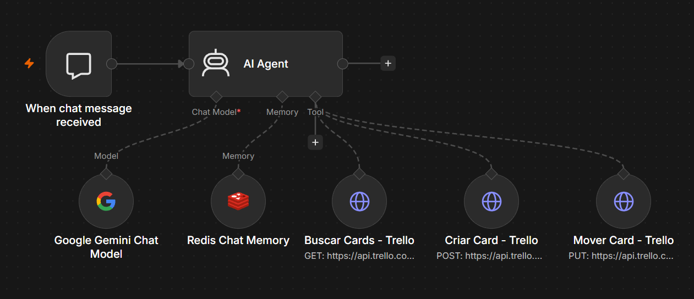

# 🤖 AI Agent for Trello Task Management via Chat
[Traduzir para Poruguês](https://github.com/sthefanyalaminos/agent-task-manager/blob/main/README.md)
 
> n8n automation that turns a simple chat conversation into automatic Trello card updates.


 
---
This project came from wanting to simplify something I do every day: organizing my tasks. Instead of opening the Trello board and dragging cards manually, I built an AI agent that talks to me, understands what I say about my day's progress, and updates the board on its own.
 
When the conversation starts, the agent greets the user and asks what the day's tasks are. From there, the user just reports progress through chat: "I started task X", "I finished Y", and the agent identifies the right stage and automatically moves the card between:
 
- **To Do** - planned tasks
- **In Progress** - tasks being worked on
- **Done** - finished tasks

The integration happens in real time: every update given in chat is reflected immediately on the Trello board.

## How it works
1. The user starts the conversation in the n8n chat.
2. The agent (Google Gemini) greets the user and asks about the day's tasks.
3. The user reports progress on each task in natural language.
4. The agent interprets the message and identifies which card and which new stage.
5. An HTTP request is sent to the Trello API, moving the card to the corresponding list.
6. Redis keeps the conversation history, giving the agent context across interactions.
## Tech stack
- **n8n** - Workflow orchestration
- **Google Gemini (Google AI API)** - Agent's language model
- **Redis** - Chat memory (Redis Chat Memory)
- **Trello API** - Reading and updating cards via HTTP Request
## Workflow architecture
 
```
Chat Trigger (n8n)
      │
      ▼
AI Agent 
      ├── Gemini Chat Model (language model)
      │
      ├── Redis Chat Memory (conversation context)
      │
      └── HTTP Request → Trello API (fetch, create and move card between lists)
```
 
## Getting started
1. Import the `workflow.json` file into your n8n.
2. Set up the credentials:
   - **Google AI API Key** (Gemini)
   - **Redis** (host, port and password)
   - **Trello API Key + Token**
3. Adjust the Trello list IDs (To Do, In Progress, Done) in the HTTP Request nodes.
4. Activate the workflow and start the conversation through the n8n chat.

## Authorship
Project developed by Sthefany Alaminos.